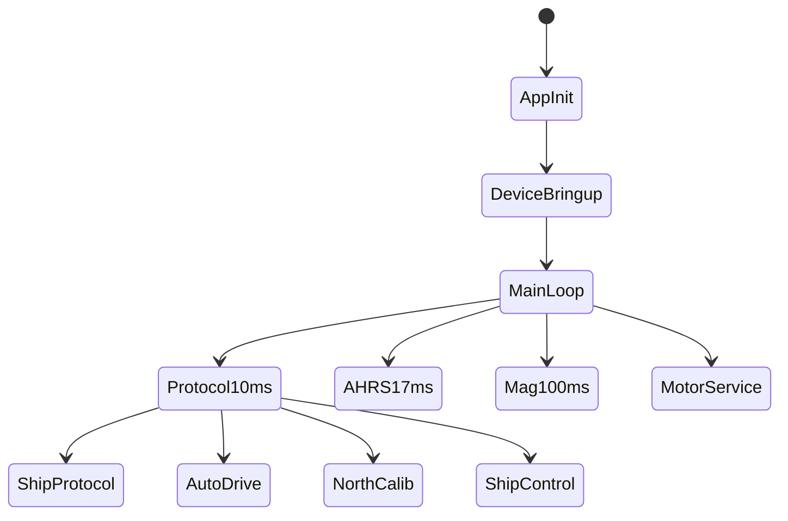
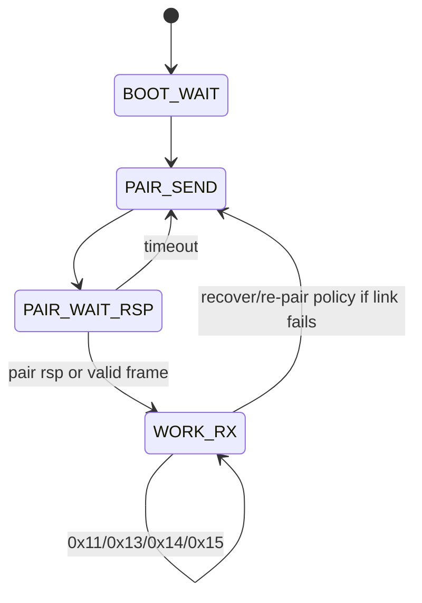
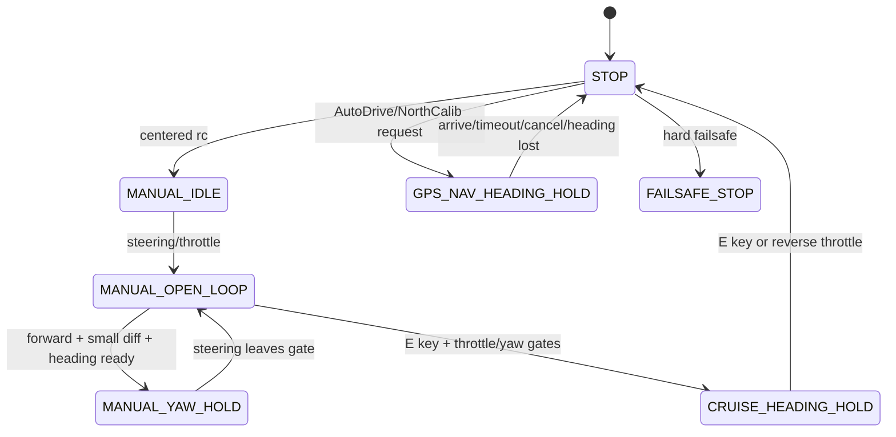
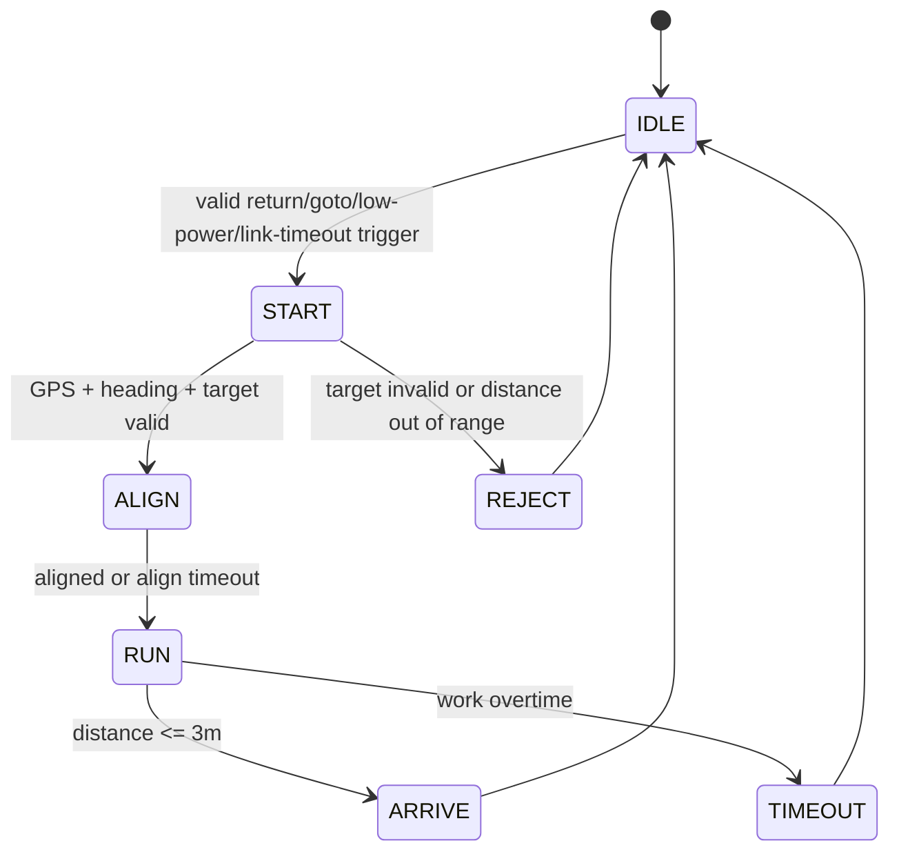
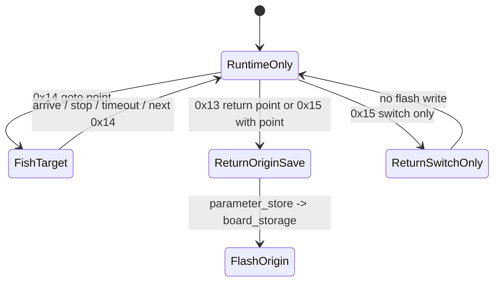
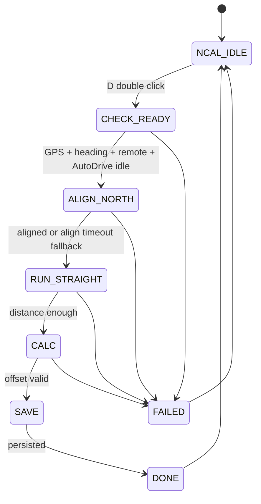

# Black Pearl v2.0 持久目标 README

本文件用于在跨会话、跨人员接手时固定 Black Pearl v2.0 的长期重构目标。
后续任何实现、调试或文档补充，都应先对照这里确认目标、边界、优先级和完成判定。

## 目标

在保留 Black Pearl v1.1 已验证业务行为的前提下，把 v2.0 收口为
EmbedForge Level 1.5 工程：

- `App` 只编排应用生命周期、协议分发和业务状态机。
- `BoardDevices` 负责具体板级硬件访问，隐藏引脚、总线、地址和 STC 驱动细节。
- `Components` 负责 AHRS、航向、滤波、PID 等纯算法。
- `Services` 负责日志、参数和持久化等轻量系统能力。

Graphify 和源码对照的当前结论是：v2.0 分层方向基本正确，主要缺口不是架构边界，
而是 v1.1 的完整业务闭环尚未全部迁入。当前优先补齐 D 键北向校准、
校准期间控制权隔离，以及统一的 `raw heading + north_offset` 航向出口。

## 范围

### 必须完成

- 将 v1.1 的 `NorthCalib` 业务迁入 v2.0，并保持 D 键双击启动、E 键取消、
  手动覆盖失败、超时失败和成功持久化等行为。
- 增加 raw fused heading 与 calibrated navigation heading 两类航向出口。
- 让 `ShipControl` 继续独占所有最终电机写入。
- 让 `AutoDrive` 和 `NorthCalib` 只能通过 `ShipControl_RequestGpsAlign()`、
  `ShipControl_RequestGpsNav()`、`ShipControl_Stop()` 或 yaw-hold reset 类接口请求控制。
- 明确持久化范围：船端 flash 只保存返航原点和北向校准 offset；钓点必须由遥控器
  每次通过 `0x14` 下发，船端只保留当前运行态目标，不保存钓点表。
- 保持旧无线协议兼容，尤其是 `0x12` 固定 15 字节 payload。
- 新增 `doc/state_machines.md`，保存最终状态图、事件优先级矩阵、命令到状态映射和
  v1.1/v2.0 行为对齐清单。

### 暂不做

- 不引入产品级 Level 2 设备注册表。
- 不引入全局事件总线、复杂电源框架、OTA、完整 fault framework 或正式 CI size report。
- 不在 `App` 或 `Components` 中直接包含 STC vendor 头、裸寄存器、裸端口或官方驱动 API。

## 状态机总览

应用主循环：

无线协议：

船体控制：

AutoDrive：

AutoDrive 持久化：

NorthCalib：

## 每轮调度优先级

1. 硬安全：航向丢失、遥控/手动超时、显式停机和电机停机。
2. `NorthCalib` busy：占用 GPS heading-control 路径；阻塞 `0x13/0x14/0x15`、
   低电返航触发和手动电机更新；只允许 E 取消或手动覆盖失败。
3. `AutoDrive` busy：占用 GPS 导航；阻塞手动电机更新，允许链路保活和状态回包。
4. E 键巡航航向保持：E 或反向油门可退出；否则占用 yaw-hold。
5. 手动控制：开环或手动 yaw-hold。
6. 观察事件：电源采样、SPI-PS 事件、日志和 `app_extension` 回调。

## 关键改动清单

- 新增 `App/Inc/north_calib.h` 和 `App/Src/north_calib.c`。
- 从 v1.1 迁入 `NorthCalib` 状态：
  `IDLE/CHECK_READY/ALIGN_NORTH/RUN_STRAIGHT/CALC/SAVE/DONE/FAILED`。
- 迁入失败原因、D 双击触发、E 取消、手动覆盖、超时、offset 合法性检查和
  EEPROM A/B-slot 风格持久化。
- 持久化链路走 `parameter_store -> board_storage`，不让 `App` 直接访问 STC EEPROM。
- AutoDrive 持久化链路只保存 10 字节返航原点；`0x14` 钓点和 `0x15` 开关不写 flash。
- 扩展 `app.h` 或 AHRS 状态出口：
  `app_get_raw_heading_deg100()` 返回未校准融合航向；
  `app_get_heading_deg100()` 返回 `raw + NorthCalib_GetHeadingOffsetCd()`。
- 更新 `ship_protocol_cmd.c`：
  D 键双击启动 `NorthCalib`；
  `NorthCalib` busy 时 E 键先取消校准，再处理巡航语义；
  B/C 保持 no-op 事件；
  A 在板级 LED API 确认前继续作为 extension-only 事件。
- 更新 `ship_protocol_run_scheduler()` 调用顺序：
  RX parse、safety/timeouts、power、AutoDrive link tick、`AutoDrive_Poll()`、
  `NorthCalib_Poll()`、diagnostics、`ShipControl_Tick()`。
- 明确 busy guard，避免 AutoDrive、NorthCalib、巡航和手动控制同时抢同一个电机出口。

## 对外接口

`north_calib.h` 公开接口建议保持最小：

- `NorthCalib_Init`
- `NorthCalib_UpdateRemoteInput`
- `NorthCalib_RequestStart`
- `NorthCalib_Poll`
- `NorthCalib_Cancel`
- `NorthCalib_IsBusy`
- `NorthCalib_GetHeadingOffsetCd`

App 航向 API：

- raw heading 供校准内部计算使用。
- calibrated heading 供 `ShipControl`、`AutoDrive`、协议状态和日志使用。

协议事件：

- 默认不改变空口协议。
- `ship_protocol_event_snapshot_t` 只有在日志或上位机确实需要区分校准事件时，
  才新增 calibration event type。

## 完成判定

实现可以判定为完成，需要同时满足：

- D 单击不启动校准，D 双击能启动 `NorthCalib`。
- GPS、航向、遥控和 AutoDrive busy 条件不满足时，校准会拒绝并给出明确失败原因。
- 校准期间 `0x13/0x14/0x15`、低电返航和手动电机更新不会抢占控制权。
- 校准期间 E 键能取消，明显手动覆盖会失败退出。
- 成功校准后 offset 被持久化，重启后可加载。
- offset 跳变过大时拒绝覆盖旧记录。
- `app_get_heading_deg100()` 统一输出已校准航向，AutoDrive、ShipControl 和状态回包不各自重复叠加 offset。
- `0x12` 仍是 15 字节 payload，`payload[13]` 为 `0..4` 电量，`payload[14]` 为 AutoDrive 状态。
- flash 中 AutoDrive 槽只保存返航原点；`0x14` 钓点断电丢失，下一次任务必须由遥控器重新下发。
- `0x15` 不带返航点时只更新运行态开关，不擦写 flash。
- 默认日志仍保持 C251 可接受长度，新增 `[NCAL]` 日志短而可定位。
- 分层边界检查通过：`App` 和 `Components` 没有直接包含 STC vendor/platform 头或裸寄存器。

## 测试计划

- 静态边界检查：确认 `App`、`Components` 不直接包含 STC 头、不访问裸 pin/register；
  `BoardDevices/Inc` 不暴露裸硬件资源。
- 状态机代码审查：覆盖 protocol pair/retry/work RX、`0x11`、`0x13/0x14/0x15`、
  AutoDrive start/reject/arrive/timeout、巡航 enter/exit 和低电 latch。
- 持久化场景：`0x13` 和带点位 `0x15` 会保存返航原点；`0x14` 只设置当前钓点目标；
  不带点位 `0x15` 不触发 `AutoDriveCfg_Save()`。
- NorthCalib 场景：
  D 单击 no-op、D 双击 start、E cancel、manual override failure、GPS not ready reject、
  AutoDrive busy reject、successful save/load、offset jump reject without overwrite。
- 硬件/日志验收：
  `[CTRL]`、`[SHIP]`、`[AHRS]`、`[HDG]`、`[NCAL]` 日志能定位关键状态；
  旧遥控器和上位机仍能按原 `0x12` 字段工作。

## 维护规则

- v2.0 是重构目标；v1.1 是只读行为来源。
- v1.1 当前行为是权威参考，包括 yaw-hold 参数、GPS 点位格式、电源语义、
  低电返航和 D 键北向校准。
- 每次实现跨状态机行为时，先更新或核对本文件的优先级和完成判定。
- 如果新增状态图、命令映射或 parity checklist，写入 `doc/state_machines.md`。
- 如果修改了协议字段、日志字段或外包对接入口，同步更新根 `README.md` 或 `doc/README.md`。
- 如果修改了迁移事实或资源边界，同步更新 `doc/data.md` 或 `doc/total.md`。
