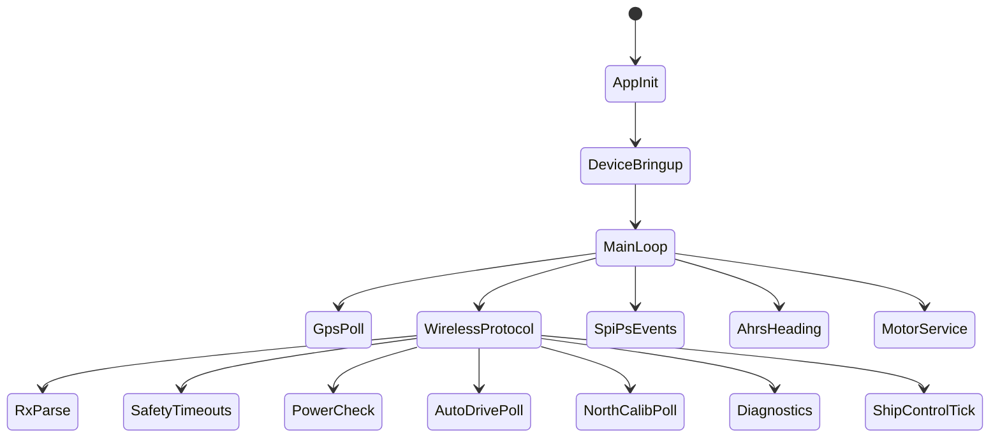
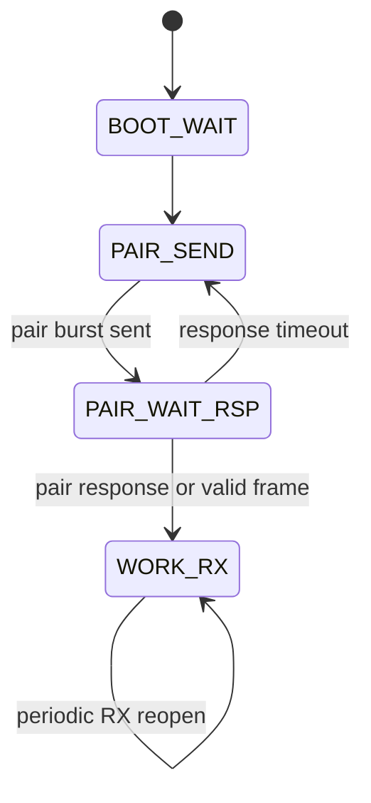
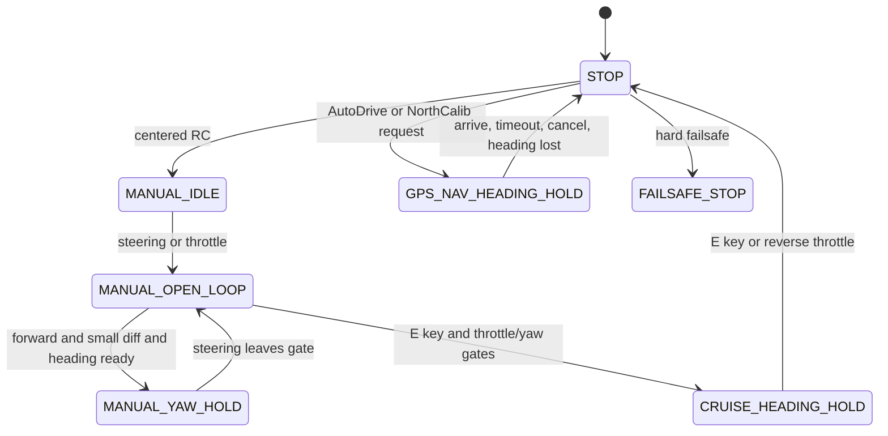
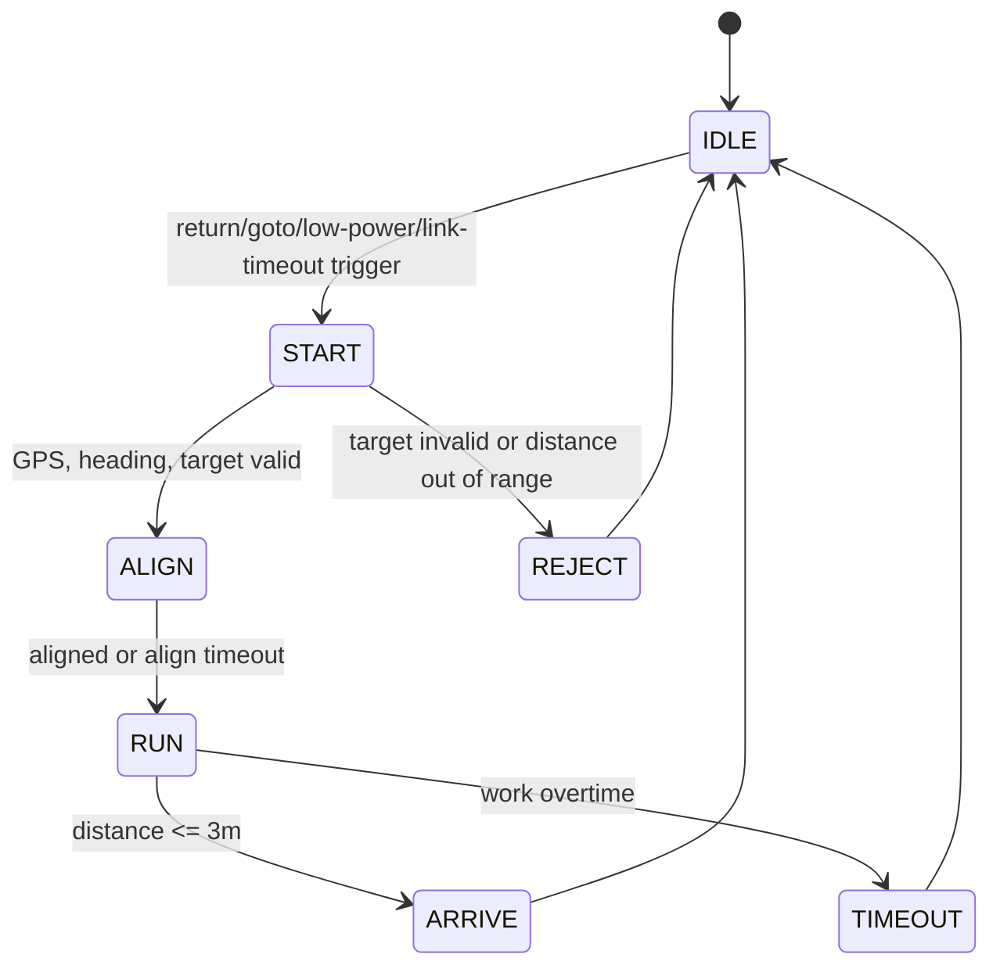
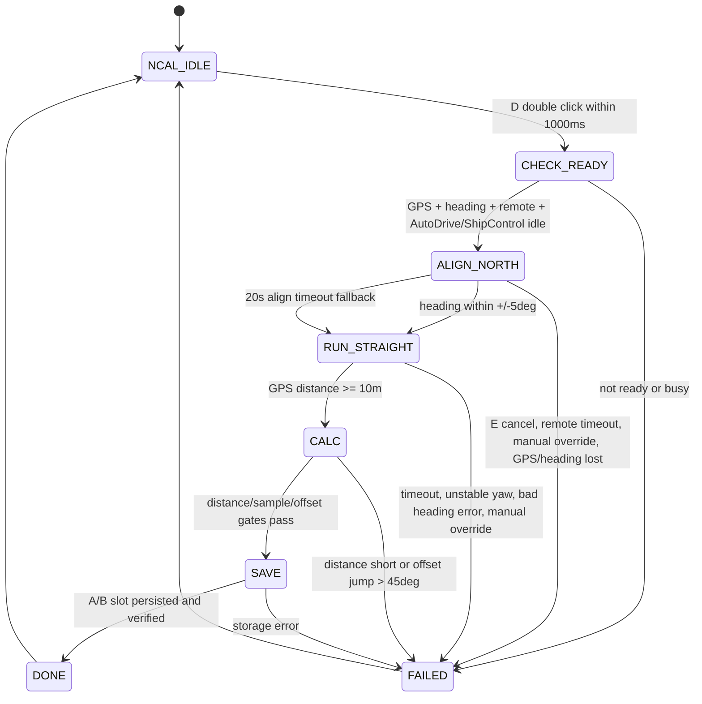

# Black Pearl v2.0 State Machines

本文档记录 v2.0 当前迁移后的关键状态机关系。v1.1 是行为来源，v2.0 按 EmbedForge Level 1.5 分层落地：

- `App` 编排协议、AutoDrive、NorthCalib 和 ShipControl 状态机。
- `BoardDevices` 隐藏 GPS、无线、电机和存储硬件细节。
- `Components` 保持 AHRS、HeadingEstimator、PID 等纯算法。
- `Services` 提供 logger 和 parameter_store，NorthCalib 不直接访问 STC EEPROM。

## Application Schedule

## Wireless Protocol

## ShipControl

ShipControl owns the final motor write. AutoDrive and NorthCalib only request `ShipControl_RequestGpsAlign()`, `ShipControl_RequestGpsNav()`, `ShipControl_Stop()`, or yaw-hold reset.

## AutoDrive

## NorthCalib

## Event Priority

| Priority | Event class | Behavior |
| --- | --- | --- |
| 1 | Hard safety | Heading lost, remote/manual timeout, explicit stop, failsafe stop force ShipControl stop. |
| 2 | NorthCalib busy | Blocks `0x13/0x14/0x15`, low-power return, E cruise, and manual motor updates. E key edge cancels calibration. |
| 3 | AutoDrive busy | Blocks manual motor updates and E cruise. Link keepalive and status reports continue. |
| 4 | E cruise | Toggles cruise only when no higher-priority owner is busy and heading/throttle/steering/yaw gates pass. |
| 5 | Manual control | Open-loop or manual yaw-hold through ShipControl. |
| 6 | Observability | Power samples, SPI-PS events, logs, and extension callbacks. |

## Command Mapping

| Command/key | v2.0 mapping | Busy behavior |
| --- | --- | --- |
| `0x11` throttle | Updates protocol snapshot, NorthCalib remote snapshot, then ShipControl manual input if allowed. | NorthCalib blocks manual updates except E cancel. AutoDrive blocks manual updates. |
| D key | Single click waits only; second click within 1000ms calls `NorthCalib_RequestStart()`. | Start is rejected unless NorthCalib idle. |
| E key | Cruise toggle when idle/manual; cancel when NorthCalib busy. | NorthCalib cancel wins before cruise semantics. |
| B/C key | Published as no-op key action event. | No control effect. |
| A key | Extension-only key edge until a BoardDevices LED API is explicitly assigned. | No control effect. |
| `0x13` | `AutoDrive_SetReturnPositionRaw()`. | Ignored while NorthCalib busy. |
| `0x14` | `AutoDrive_SetFishPositionRaw()`. | Returns busy while NorthCalib busy. |
| `0x15` | `AutoDrive_SetSwitchRaw()`. | Ignored while NorthCalib busy. |
| `0x12` | Fixed 15-byte status payload. `payload[13]` remains power `0..4`, `payload[14]` remains AutoDrive status. | Unchanged. |

## v1.1/v2.0 Behavior Parity

| v1.1 behavior | v2.0 location |
| --- | --- |
| D double-click starts GPS north calibration. | `App/Src/ship_protocol_cmd.c`, `NorthCalib_RequestStart()` |
| E cancels calibration while busy. | `App/Src/ship_protocol_cmd.c`, `NorthCalib_Cancel(NORTH_CALIB_FAIL_USER_CANCEL)` |
| Calibration checks GPS, heading, remote link, AutoDrive/ShipControl idle. | `App/Src/north_calib.c` `CHECK_READY` |
| Align north, straight run, calculate GPS course minus raw heading average. | `App/Src/north_calib.c` |
| Offset jump over 45deg does not overwrite old persisted record. | `App/Src/north_calib.c` `CALC` |
| EEPROM A/B-slot style persistence. | `Services/Src/parameter_store.c` via `BoardDevices/Src/board_storage.c` |
| Unified calibrated navigation heading. | `app_get_heading_deg100()` returns raw heading + `NorthCalib_GetHeadingOffsetCd()` |
| Raw heading remains available for calibration math. | `app_get_raw_heading_deg100()` |
| Final motor write is centralized. | `ShipControl_SetMotorTargets()` in `App/Src/ship_control_core.c` |

## Layer Checks

- `App` does not include `STC32G_EEPROM.h`; NorthCalib persistence goes through `parameter_store`.
- `Components` do not include BoardDevices, Drivers, or vendor headers.
- `0x12` wire payload length remains `15`.
- `AutoDrive`, `NorthCalib`, cruise, and manual control do not directly write motor hardware.
