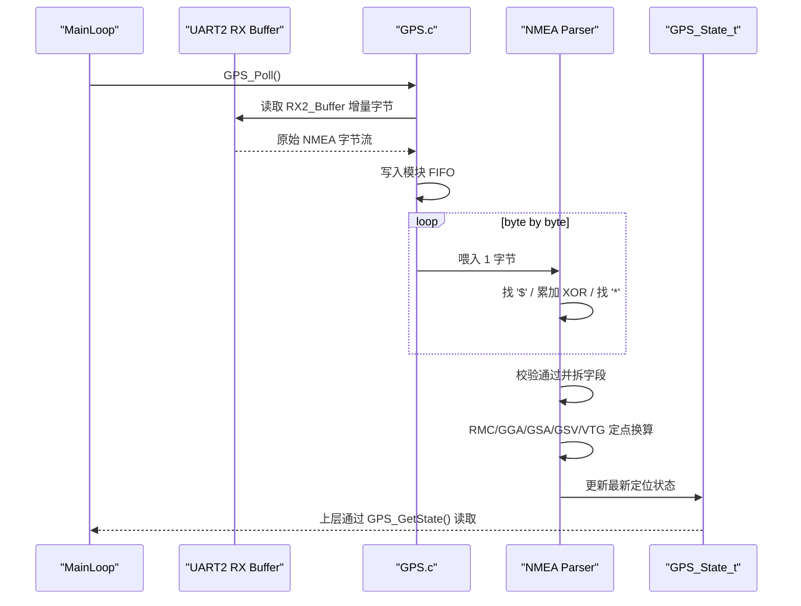

# GPS 模块说明

## 概述

`Code_boweny/Device/GPS/` 模块用于接收并解析 NMEA0183 GPS / 北斗 / 多模 GNSS 语句。

当前实现严格遵循工程约束：

- 不修改 Driver 层 API 与 ISR
- 接收链路固定为 `UART2 -> Driver RX2_Buffer -> GPS FIFO -> NMEA Parser`
- 解析器采用逐字符状态机，不使用 `strtok`
- 所有位置、速度、航向、海拔和 DOP 数据全部使用定点整数，不使用浮点

## 当前硬件接线

```text
STC32G            GPS Module
------            ----------
P1.0  (UART2 RX) <- TX
P1.1  (UART2 TX) -> RX
3.3V             -> VCC
GND              -> GND
```

## 串口参数

| 项目 | 配置 |
|------|------|
| 外设 | UART2 |
| 引脚 | RX=P1.0, TX=P1.1 |
| 波特率发生器 | Timer2 |
| 默认波特率 | `GPS_BAUDRATE = 115200` |
| 当前透传测试 | `GPS_RAW_ECHO_ENABLE = 0`，当前已关闭 UART2->UART1 原始透传，避免影响其它联调观察 |
| 帧格式 | 8N1 |

> 说明：UART2 固定占用 Timer2，因此当前工程已停用 `APP_AD_UART` 示例和 `Sample_ADtoUART` 任务，避免资源冲突。

## 支持的 NMEA 语句

| 语句 | 用途 | 当前处理 |
|------|------|----------|
| `RMC` | 主状态更新 | 时间、日期、经纬度、速度、航向、有效定位状态 |
| `GGA` | 定位补充 | fix quality、卫星数、HDOP、海拔 |
| `GSA` | 精度补充 | fix mode、PDOP、HDOP、VDOP |
| `GSV` | 可见卫星 | satellites_view、max_snr |
| `VTG` | 速度/方向补充 | 速度、航向 |

## 数据单位

| 字段 | 单位 |
|------|------|
| `lat_deg1e7` / `lon_deg1e7` | 度 × 10^7 |
| `speed_knots_x100` | 节 × 100 |
| `speed_kmh_x100` | km/h × 100 |
| `course_deg_x100` | 度 × 100 |
| `altitude_cm` | 厘米 |
| `hdop_x100` / `pdop_x100` / `vdop_x100` | × 100 |

示例：

- `lat_deg1e7 = 299998750` 表示 `29.9998750°`
- `speed_kmh_x100 = 1234` 表示 `12.34 km/h`
- `altitude_cm = 6280` 表示 `62.80 m`

## 对外接口

```c
s8 GPS_Init(void);
void GPS_Reset(void);
void GPS_Poll(void);
const GPS_State_t *GPS_GetState(void);
```

### `GPS_Init()`

完成以下工作：

- 切换 `UART2_SW(UART2_SW_P10_P11)`
- 恢复 `P1.0/P1.1` 为 UART2 所需口模式
- 初始化 UART2 和中断
- 清空模块内部 FIFO、语句缓存和状态结构体

### `GPS_Poll()`

主循环高频调用函数：

- 从 `RX2_Buffer` 拉取增量字节
- `GPS_RAW_ECHO_ENABLE=1` 时可选透传原始字节到 UART1
- 写入模块内 FIFO
- 逐字节驱动 NMEA 状态机
- 完成校验、字段拆分、定点换算和状态更新

### `GPS_GetState()`

返回模块内部维护的只读 `GPS_State_t` 指针，供上层查询最新 GPS 状态。

## 当前系统接入点

GPS 已接入以下运行链路：

```text
SYS_Init()
  -> APP_config()
  -> log_init()
  -> GPS_Init()

main()
  -> while(1)
       GPS_Poll()
       Wireless_Poll()
       ShipProtocol_RunScheduler()
       Wireless_SearchSignalPoll()
       IMU_ServicePoll()
       IMU_AhrsPoll()
       Task_Pro_Handler_Callback()
```

说明：

- `GPS_Poll()` 放在主循环前部，优先处理串口流，降低丢帧风险
- `update_sequence` 仅在新的有效主状态提交后递增
- GPS 详细诊断日志受 `GPS_DIAG_LOG_ENABLE` 控制

## 运行时序图



## 解析策略

实现细节固定如下：

- 新收到 `$` 时开始一帧采集
- 在 `*` 前完成 XOR 校验计算
- 只接受校验通过的标准 NMEA 语句
- 支持语句必须先完整解析成功，才会回写 `GPS_State_t`，避免坏句子污染上一帧有效状态
- 校验失败、字段错误、FIFO 溢出、语句超长均写入状态计数器
- Talker 支持 `GP / BD / GN`
- `RMC` 作为主数据源，`GGA/GSA/GSV/VTG` 只补充其余字段
- 经纬度换算使用 32 位安全定点公式，避免大数乘法溢出

## 注意事项

1. 不要在上层直接改写 `COM2`、`RX2_Buffer` 或 `COM2.RX_Cnt`
2. 不要把 GPS 改到 UART1；UART1 已用于 LOG 输出
3. 不要重新启用 `APP_AD_UART`，否则会重新占用 Timer2
4. 如果后续需要修改 GPS 波特率，只改 `GPS_BAUDRATE` 宏即可
5. 当前默认 `GPS_RAW_ECHO_ENABLE=0`，不会自动做 UART2->UART1 原始透传
6. 本模块不维护完整卫星表，`GSV` 当前只汇总 `satellites_view` 与 `max_snr`
7. 受 Driver 接口限制，`uart_overflow_count` 更适合作为 UART2 接收缓冲回卷/覆盖风险计数，不是精确的丢字节统计值

## 相关文件

- `Code_boweny/Device/GPS/GPS.h`
- `Code_boweny/Device/GPS/GPS.c`
- `doc/build_doc/README_GPS.md`
- `doc/project_doc/total.md`
- `doc/project_doc/date.md`

## 版本历史

| 日期 | 版本 | 说明 |
|------|------|------|
| 2026-04-24 | v1.0 | 新建 GPS 模块，接入 UART2(P1.0/P1.1)，实现 NMEA 状态机解析、定点状态输出与失败前不落状态的安全更新 |
