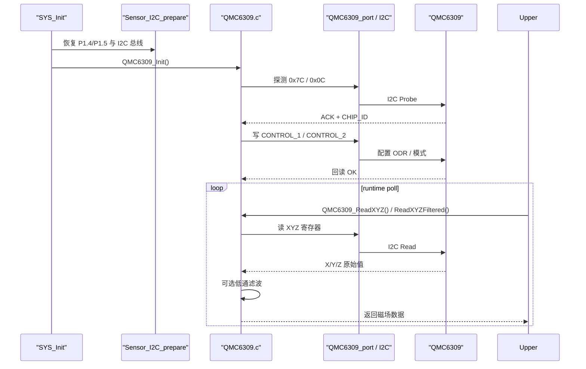

# QMC6309 地磁计驱动说明

## 概述

`Code_boweny/Device/QMC6309/` 是 QMC6309 三轴地磁计驱动模块，运行链路为 `User/System_init.c` -> `Code_boweny/Device/QMC6309/QMC6309.c`。

当前根目录工程里它不是“只上电观测”的独立模块，而是进入了 AHRS 航向链：

```text
SYS_Init()
  -> QMC6309_Init()

MainLoop_RunOnce()
  -> IMU_AhrsPoll()
     -> QMC6309_ReadXYZFiltered()
     -> AHRS_UpdateRawMag()
```

默认运行档：

- `ENABLE_MAG_MODULE = 1`
- `ENABLE_MAG_STANDALONE_POLL = 0`
- `AHRS_MAG_PERIOD_MS = 100`

也就是磁力计默认不单独刷屏，而是每约 `100ms` 由 AHRS 低频读取一次。

## 当前配置

| 项目 | 说明 |
|------|------|
| 器件 | QMC6309 三轴地磁计 |
| 总线 | STC32G 硬件 I2C |
| 引脚 | `P1.4(SDA) / P1.5(SCL)` |
| 地址探测顺序 | 主地址 `0x7C`，备用地址 `0x0C` |
| 芯片 ID | `0x90` |
| 默认配置 | `CONTROL_1=0x1B`，`CONTROL_2=0x10`，10Hz |

## 当前验证结果

当前运行链路已经验证可用：

- `Probe addr=0x7C write=0xF8: ACK`
- `CHIP_ID=0x90`
- `CTRL1=0x1B CTRL2=0x10`
- XYZ 读数返回有效有符号数据

## 重要文件

- `QMC6309.c`：驱动实现。
- `QMC6309.h`：公开常量和 API。
- `doc/device_doc/QMC6309.md`：器件行为和寄存器说明。
- `doc/project_doc/total.md`：项目级问题记录和 I2C XSFR 说明。

## 问题记录

### XSFR / EAXFR 问题

STC32G 硬件 I2C 寄存器位于扩展 SFR 区域，例如：

- `I2CCFG`
- `I2CMSCR`
- `I2CMSST`

如果没有先启用 `EAXFR`，对这些寄存器的写入不会真正到达 I2C 控制器。典型现象是日志停在第一次探测，代码进入 `Start()` 后底层 `Wait()` 永远不完成。

修复方式：在 `SYS_Init()` 开始处调用 `EAXSFR()`。

### P1.4 / P1.5 被 App 初始化覆盖

早期 bring-up 失败曾由 `ADtoUART_init()` 将所有 `P1.x` 引脚重新配置为高阻输入导致，覆盖了硬件 I2C 的 `P1.4/P1.5` 引脚模式。

当前状态：

- `APP_config()` 不再启用 `ADtoUART_init()`。
- `SYS_Init()` 仍保留 `APP_config()` 之后的 `Sensor_I2C_prepare()` 作为防御性恢复。
- 共享 I2C 总线会在 `QMC6309_Init()` 和 `QMI8658_Init()` 前显式恢复。

### 小整数日志误导

早期调试日志中出现类似 `257` 的值，这不是实际 GPIO/I2C 状态，而是日志可变参数中小整数格式化不安全导致。

建议：

- 不要直接用 `%u` 打印 `bit` 状态。
- 优先输出 `H/L`、`Y/N` 或先扩展为普通整数。

## 日志策略

保留的日志：

- 地址探测结果
- 选中的 I2C 地址
- ready / chip-id 结果
- 控制寄存器回读
- 总线恢复和错误日志
- 成功 `WriteReg` 的关键数据日志

已移除或弱化的日志：

- `Main.c` 中临时 `TEST` 日志
- 一次性 dump/read 自测日志
- 重复初始化 debug 日志

## API

```c
s8 QMC6309_Init(void);
s8 QMC6309_ReadXYZ(int16 *x, int16 *y, int16 *z);
s8 QMC6309_ReadXYZFiltered(int16 *x, int16 *y, int16 *z);
u8 QMC6309_ReadID(void);
s8 QMC6309_SetODR(u8 odr);
s8 QMC6309_Wait_Ready(u16 timeout_ms);
void QMC6309_DumpRegs(u8 target_addr);
```

## 初始化与读数时序图



## 低通滤波接入

原始读取路径保留：

```text
QMC6309_ReadXYZ()
```

滤波读取路径：

```text
QMC6309_ReadXYZFiltered()
  -> QMC6309_ReadXYZ()
  -> Filter_MagLowPass()
```

注意：

- 首帧有效数据直接透传。
- 无效原始帧不会更新滤波状态。
- 每次 `QMC6309_Init()` 成功后会复位滤波状态。
