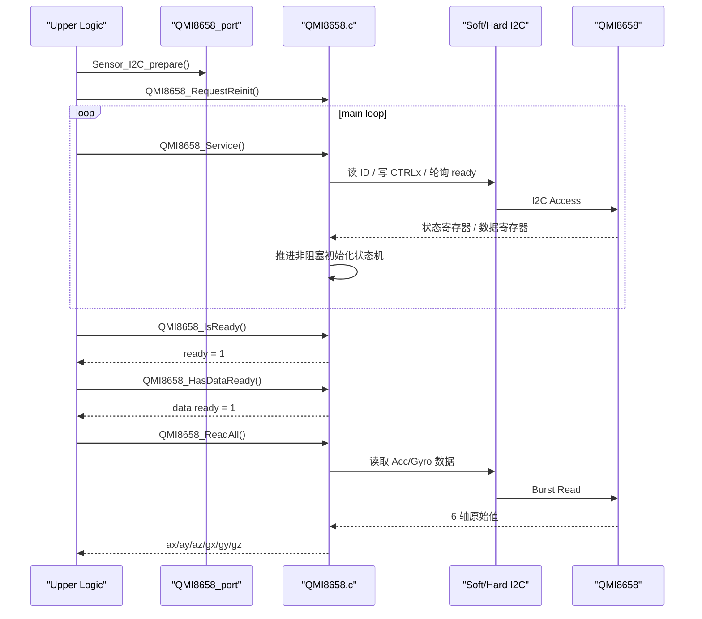

# QMI8658 IMU 驱动

## 概览

当前 `QMI8658` 已重构为两层：

1. `QMI8658_port.c/.h`
   - 负责 `P1.4/P1.5` 板级口线
   - 负责软/硬 I2C 后端切换
   - 负责微秒延时和总线恢复
2. `QMI8658.c/.h`
   - 负责寄存器配置
   - 负责非阻塞初始化状态机
   - 负责 ready 标志与 6 轴数据读取

当前工程默认：

- `QMI8658_I2C_USE_SOFT = 0`
- `QMI8658_READY_MODE_STATUS0 = 1`
- `QMI8658_READY_MODE_STATUSINT = 0`
- `QMI8658_INIT_NONBLOCKING = 1`
- `ENABLE_IMU_MODULE = 1`
- `ENABLE_IMU_AHRS_POLL = 1`
- `ENABLE_IMU_BASIC_POLL = 0`

## 当前接口

兼容保留：

```c
s8 QMI8658_Init(void);
u8 QMI8658_ReadID(void);
s8 QMI8658_ReadAcc(int16 *x, int16 *y, int16 *z);
s8 QMI8658_ReadGyro(int16 *x, int16 *y, int16 *z);
s8 QMI8658_ReadGyroFiltered(int16 *x, int16 *y, int16 *z);
s8 QMI8658_ReadTemp(int16 *temp);
s8 QMI8658_ReadAll(int16 *ax, int16 *ay, int16 *az,
                   int16 *gx, int16 *gy, int16 *gz);
u8 QMI8658_GetLastI2cError(void);
char *QMI8658_GetLastI2cErrorName(void);
```

新增状态机接口：

```c
s8 QMI8658_Service(void);
void QMI8658_RequestReinit(void);
u8 QMI8658_IsReady(void);
QMI8658_State_t QMI8658_GetState(void);
u8 QMI8658_HasDataReady(void);
void QMI8658_ClearDataReady(void);
u8 QMI8658_PollDataReady(void);
```

## 推荐使用方式

```c
Sensor_I2C_prepare();
QMI8658_RequestReinit();

for (;;) {
    QMI8658_Service();

    if (QMI8658_IsReady() && QMI8658_HasDataReady()) {
        int16 ax, ay, az, gx, gy, gz;

        if (QMI8658_ReadAll(&ax, &ay, &az, &gx, &gy, &gz) == 0) {
            QMI8658_ClearDataReady();
        }
    }
}
```

## 初始化与取数时序图



## 说明

- 当前根目录工程里 IMU 是启用状态，不是“今晚保持关闭”
- 当前板上没有单独接出的 IMU 外部 INT 脚，所以“中断标志位轮询”实现为寄存器 ready 位轮询
- 默认使用 `STATUS0.aDA/gDA` 作为 ready 判据
- `STATUSINT` 只保留为可选实验模式，不是当前主路径
- 本驱动不使用 DMA
- 软件 I2C 与硬件 I2C 当前都固定在 `P1.4/P1.5`
